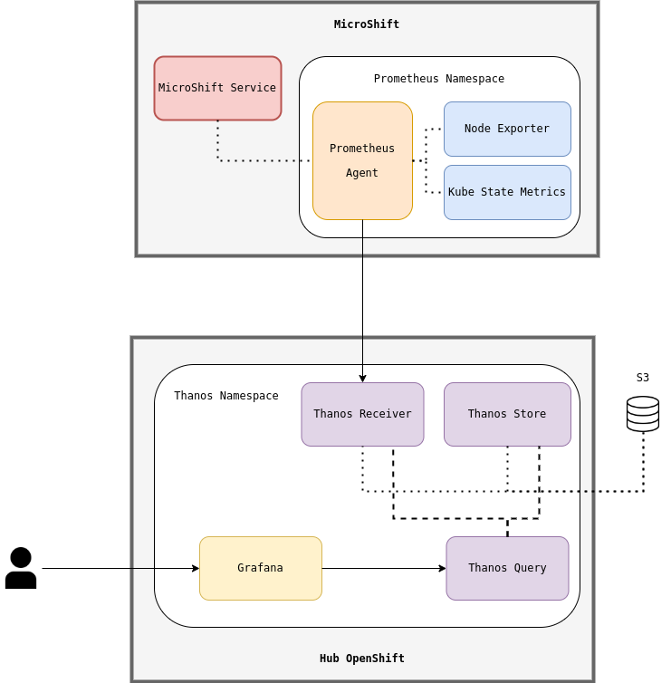
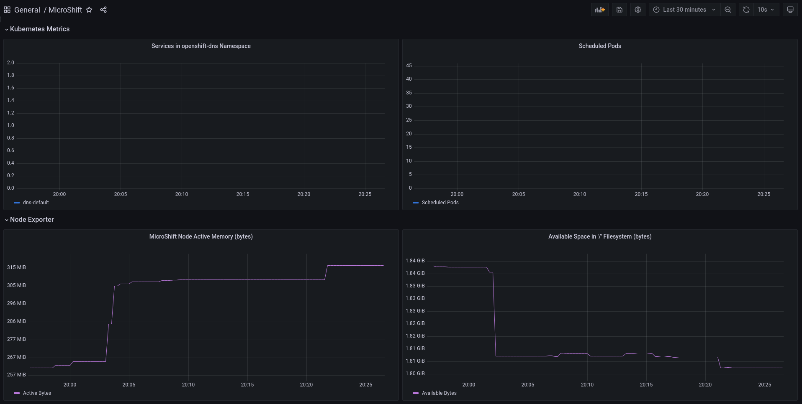

# Microshift Monitoring Stack

The repository suggests an architcture for a MicroShift 4.12 (Red Hat Device Edge) metric aggregation stack. The repository seeks to implement the architecture described in the next diagram -



## MicroShift

This section describes the monitoring components on the MicroShift instance and shows how to deploy them. The following components are installed on the MicroShift instance -

* Prometheus Agent - Lightweight Prometheus instance that forwards metrics to a centralized metric aggregator.
* Node Exporter - Exposes server resource utilization metrics.
* Kube State Metrics - Exposes Kubernetes related metrics.

### Installation

1. Create a namespace for the monitoring stack by running the next command -

```
$ oc apply -f microshift/namespace.yaml
```

2. Create the _Node Exporter_ instance by running the next command -

```
$ oc apply -f microshift/node-exporter/
```

3. Create the _Kube State Metrics_ instance by running the next command -

```
$ oc apply -f microshift/kube-state-metrics/
```

4. Create the _Prometheus Agent_ instance by running the next command -

```
$ oc apply -f microshift/prometheus-agent/
```

### Monitoring Stack Footprint

| Component             | Memory      | CPU         | Network (transmit) | Network (receive) |
| -----------           | ----------- | ----------- | -----------        | -----------
| Prometheus Agent      | 275 MiB     | 15m         | 30 KiB/s           | 3 KiB/s
| Kube State Metrics    | 50 MiB      | 1m          | 1 KiB/s            | 20 KiB/s
| Node Exporter         | 40 MiB      | 0.5m        | 30 KiB/s           | 3 KiB/s

## Dasbhoard

A dashboard that utilized the described above monitoring stack can be found [here](dashboards/dashboard.json)

The next dashboard should appear in Grafana -

